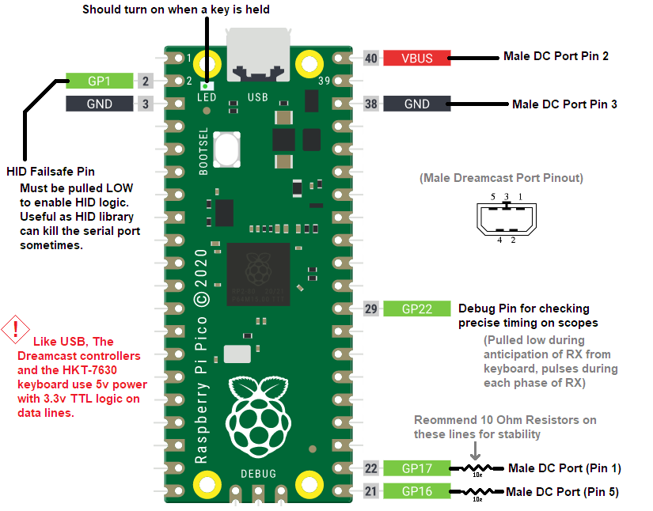

# pico_dreamcast_hid
Micropython HID Emulator for the SEGA Dreamcast HKT-7630
Emulates two maple bus commands to read keyboard data, see https://dreamcast.wiki/Maple_bus

Inspired by https://github.com/sega-dreamcast/dreamcast-controller-usb-pico
However no micropython code existed for the Pi Pico, so this is to fill a small gap in capability and prove that, with enough PIO and DMA, micropython is fast enough to talk low level with the big kids.

This was tested on a breadboarded Pico 2W, but only uses two PIOs so it should work with both Rp2040 and Rp2350 boards.

# Example Usage
Using Thonny or supportd micropython IDE, flash main.py onto the board and observe the following:

